# 🏘️ Vancouver Housing Market 

## 🏫 BCIT COMP4959 Project


  ✨ Ever dreamed of owning property in Vancouver? ✨

  Play **Vancouver Housing Market** with your friends and live out your real estate fantasies.

  Without the crushing mortgage, you'll start with $1,500, which is enough to buy several properties and a bucket of bluberries *just like our grandparents*!

  Buy up propertie**s** without a down payment, charge rent, and send your misbehaving buddies to jail... where there’s actually enough room to hold them.

  **Vancouver Housing Market** is inpired by the classic board game Monopoly, with an Elixir/Phoenix implementation.

  Now it’s your turn to make your dream come true—own your favourite neighbourhood! 
  
  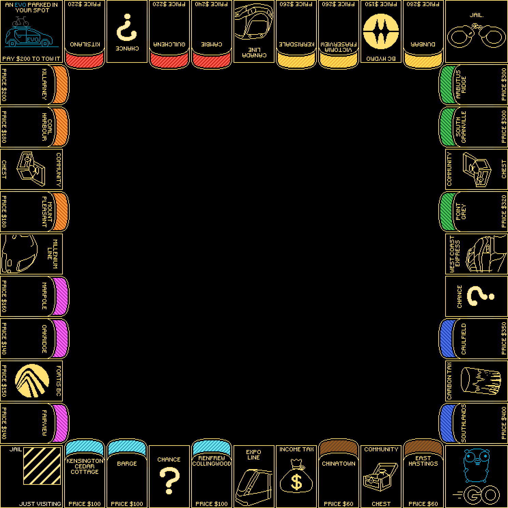


## 💻 How To Run

Play with your friends online:  
🌐 [Game Website](http://ec2-35-95-136-234.us-west-2.compute.amazonaws.com:4000/)

Or run it locally:  
🖥️ [localhost:4000](http://localhost:4000)


## 🎮 How to Play

1. Call your friends to join!

2. Visit [Game Website](http://ec2-35-95-136-234.us-west-2.compute.amazonaws.com:4000/) in your browser.

3. Click **Join the Lobby**  
   *(insert image here)*
   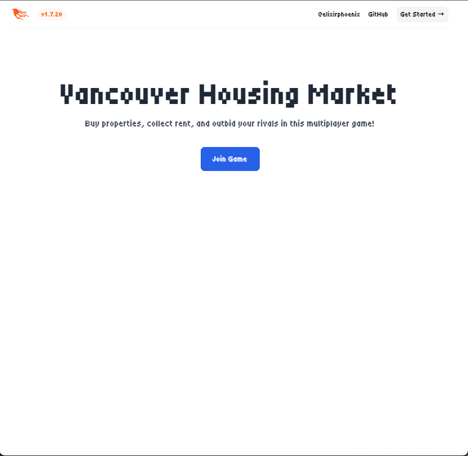

4. Once everyone’s in, click **Start Game**  
   - Start Game
   *(insert image here)*
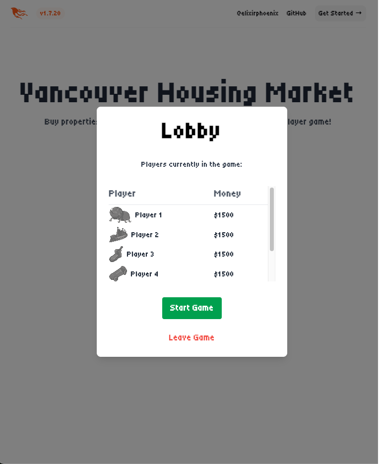

  - Starting Screen
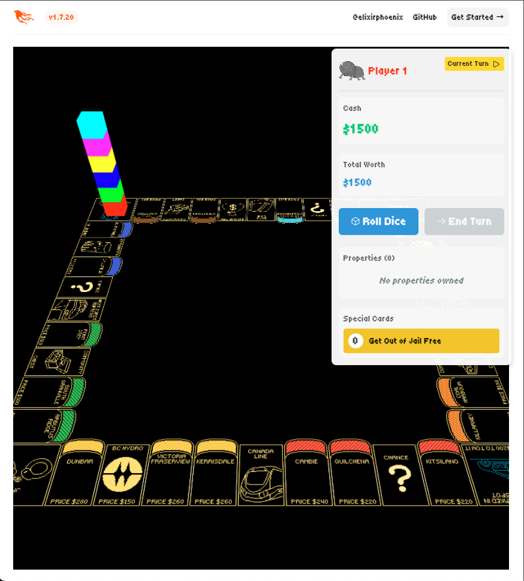

5. On your turn, select from available buttons  
   *(insert image here)*
   - Roll Dice
   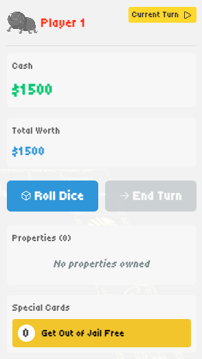

   - End Turn
   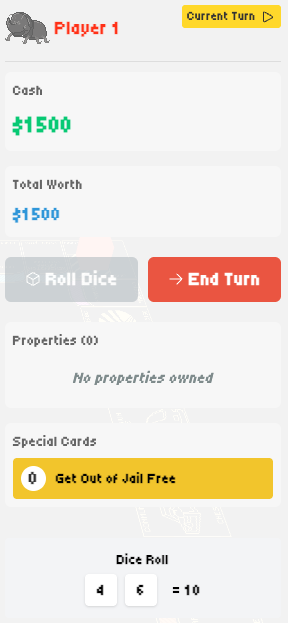


6. No need to do math—we’ve got that covered!

   - Property Modal

   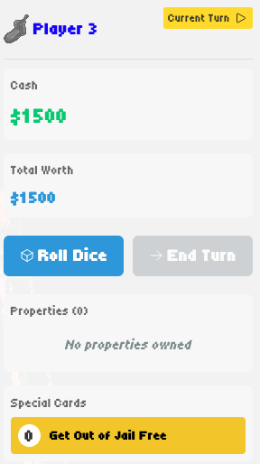
   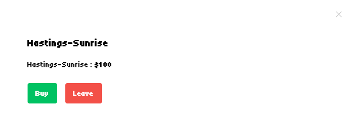
   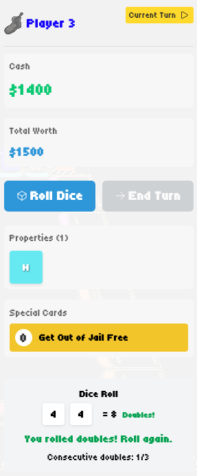

7. Wait for your friends’ turns  
   *(insert image here)*
   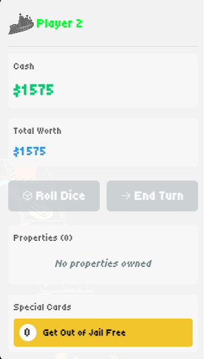

8. Repeat until there’s only one player standing!  
   *(insert image here)*
   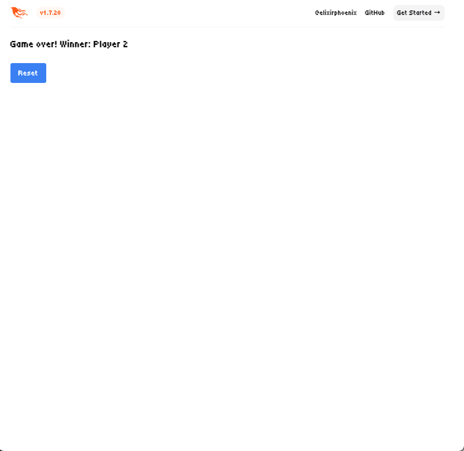


## 🎲 Game Rule

- Create a game and enter a lobby.
- 2–6 players can join, each with a unique token (car, hat, thimble, shoe, etc.).
- Players take turns in a loop.

### On Your Turn:

- 🎲 Roll 2 dice
- 🚶 Move forward by that number
- 🎁 Passing **GO** grants $200

#### On the space you land:

- **Property Space**  
  - Option to buy if unowned. If declined, it goes to **auction**.
  - If owned, pay **rent** to the owner.  
  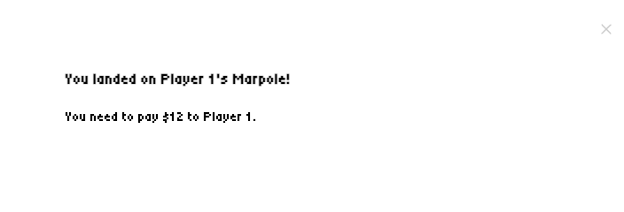
  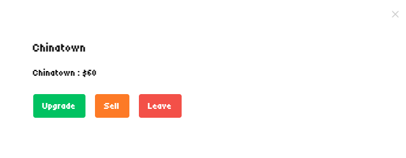
  📚 [Property Reference](https://en.wikibooks.org/wiki/Monopoly/Properties_reference)

- **Utilities (Water Works, Electric Company)**  
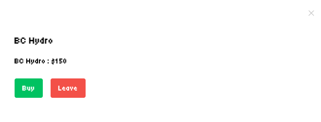
  💡 [Utility Info](https://monopoly.fandom.com/wiki/Utility)  
  - Pay 4× dice roll if owner has one utility  
  - Pay 10× if they own both

- **Railroads**  
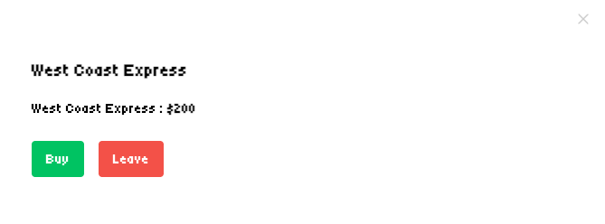
  🚆 [Railroads Info](https://monopoly.fandom.com/wiki/Railroads)  
  - Pay rent based on how many railroads the owner controls

- **Community Chest / Chance**  
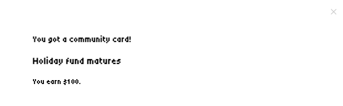
  📬 Draw a card  
  - [Community Chest](https://monopoly.fandom.com/wiki/Community_Chest)  
  - [Chance](https://monopoly.fandom.com/wiki/Chance#Cards)

- **Jail**  
  🚔 [Jail Rules](https://monopoly.fandom.com/wiki/Jail)  
  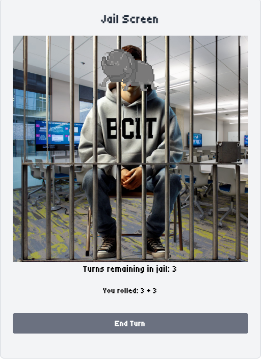
  - Just visiting? No problem.  
  - If sent to jail, you stay up to 3 turns. Escape options:
    - Pay $50
    - Roll doubles
    - Use a *Get Out of Jail Free* card

- **Free Parking** — Rest and relax  
- **Go to Jail** — Go directly to jail  
- **Luxury Tax** — Pay $100  
- **Income Tax** — Pay 10% or $100, whichever is lower

➡️ End your turn and pass to the next player.

## ⚙️ Play Flowchart

  

## 🔀 Game Logic Flowchart
- ➕ Player Joins Game  

  

- ➖ Player Leaves Game  

  

- ✅ Player Ends Turn  

  

- 🎲 Player Takes Turn  

  

- 🃏 Player Lands on Card Tile  

  

- 🏠 Player Lands on Property  

  

## 🧪 How to test / debug


### Install Dependencies
```
mix setup
```

### Run Tests
```
mix test
```
- *0 failures* = success!
- Add new tests in `/test` as `.exs` files if you need more unit tests

### Debug Locally
```
mix phx.server
```
or
```
iex -S mix phx.server
```

Then visit: [`localhost:4000`](http://localhost:4000)


## 📁 File Structure
```
COMP4959_PROJECT
├── _build/                           # Elixir build artifacts (auto-generated)
├── .elixir_ls/                       # Language server files (used by editors like VSCode)
├── assets/                           # Frontend assets (CSS, JS, Tailwind config)
│   ├── css/                          # Custom stylesheets
│   │   ├── app.css                   # Base CSS imports (via Tailwind)
│   │   ├── font.css                  # Font styling
│   │   └── player_dashboard.css      # Styles specific to player dashboard UI
│   ├── js/                           # JavaScript code for frontend interactivity
│   │   ├── app.js                    # Main JS entrypoint
│   │   ├── board.js                  # JS logic for board UI
│   │   └── vendor/                   # External JS libs (e.g. Phoenix topbar)
│   │       └── topbar.js
│   └── tailwind.config.js            # Tailwind CSS configuration
├── config/                           # Elixir config files for different environments
│   ├── config.exs                    # Base config (runs for all environments)
│   ├── dev.exs                       # Development environment config
│   ├── prod.exs                      # Production environment config
│   ├── runtime.exs                   # Runtime config (used in production releases)
│   └── test.exs                      # Test environment config
├── deps/                             # Installed dependencies (auto-managed)
├── lib/                              # Main application logic
│   ├── monopoly/                     # Game backend logic (game engine)
│   │   ├── backend/                  # Core game modules
│   │   │   ├── auction.ex            # Logic for auctions
│   │   │   ├── bank.ex               # Bank money logic
│   │   │   ├── card.ex               # Community Chest & Chance cards
│   │   │   ├── deck.ex               # Deck shuffling/drawing
│   │   │   ├── dice.ex               # Dice rolling logic
│   │   │   ├── game.ex               # Main game controller/logic
│   │   │   ├── mailer.ex             # Email sending (likely unused in this app)
│   │   │   ├── player.ex             # Player struct & logic
│   │   │   ├── property.ex           # Property logic (ownership, rent, etc.)
│   │   │   └── tile.ex               # Board tiles (actions, movement, etc.)
│   ├── monopoly_web/                 # Web interface (Phoenix LiveView UI)
│   │   ├── components/               # LiveView + Heex components
│   │   │   ├── *_modal.ex            # Modals for buying, tax, property, etc.
│   │   │   ├── game_live.ex          # Main game screen LiveView
│   │   │   ├── jail_screen.ex        # Jail-specific UI
│   │   │   └── core_components.ex    # Shared UI components
│   │   ├── controllers/              # Page routing controllers
│   │   │   ├── error_*.ex            # Error page rendering
│   │   │   ├── page_controller.ex    # Default homepage controller
│   │   │   └── page_html.ex          # Page templates
│   │   ├── helpers/                  # View helpers
│   │   │   └── sprite_helper.ex      # Helps render sprite images
│   │   ├── live/                     # Other LiveViews
│   │   │   ├── backend-testing.ex    # LiveView for testing backend directly
│   │   │   └── welcome_live.ex       # Lobby / home LiveView
│   │   ├── endpoint.ex               # Entry point for the Phoenix server
│   │   ├── router.ex                 # URL routes
│   │   ├── telemetry.ex              # Phoenix telemetry metrics
│   │   ├── gettext.ex                # Internationalization support
│   │   └── monopoly_web.ex           # Root web module
│   └── monopoly.ex                   # App startup module (entrypoint)
├── priv/                             # Private assets (DB, static, i18n)
│   ├── data/                         # Game data
│   │   ├── cards.json                # Community Chest / Chance cards
│   │   └── properties.json           # Board properties
│   ├── gettext/                      # Translation files
│   │   └── en/LC_MESSAGES/errors.po
│   ├── repo/migrations/              # Ecto migrations for DB (bidding?)
│   │   └── 20250321...create_bids.exs
│   ├── static/                       # Static assets served directly
│   │   ├── app.css                   # Tailwind output CSS
│   │   └── images/sprites/           # Game token images and board graphics
│   │       ├── Piece_*.png           # Token pieces (Dog, Car, Boot, etc.)
│   │       ├── board_image.png       # Board visual
│   │       ├── jail_scene.png        # Jail scene graphic
│   │       └── logo.svg              # Game logo
│   ├── favicon.ico
│   └── robots.txt
├── test/                             # Unit and integration tests
│   ├── game_objects/                 # Tests for game logic modules (deck, dice, etc.)
│   ├── monopoly_web/                 # Tests for LiveView and web components
│   ├── support/                      # Test helpers and shared test setup
│   │   ├── conn_case.ex
│   │   └── test_helper.exs
├── .formatter.exs                    # Code formatting config
├── .gitignore                        # Git ignored files list
├── integration-plan.txt              # Project planning doc
├── mix.exs                           # Main Elixir project config
├── mix.lock                          # Dependency lockfile
├── readme_assets                     # Image files for README.md
└── README.md                         # Project overview
```
## 🐛 Known Bugs

(need to add more on real testing)
- Although player(s) leave the game, their properties and player blocks on the board are still remaining.
- User cannot chose their action in a jail if they owns a Get Out of Jail Free card
  - The card is used automatically
- Server crashes under a certain condition
  - `MonopolyWeb.WelcomeLive` module does not have a matching `handle_info/2` clause for the some boardcast events.
  - `turn_ended`, `unowned_property` and `card_played` already exists 
  - Maybe it's fixed now?
- When a player doesn't have enough cash with properties and lands on someone else's property, they go bankrupt 
  - selling properties is not triggered
- Modals don't disappear after purchasing properties. 
  - Users are trapped in an infinite loop of sell-buy until they click the close(Leave) button
  - 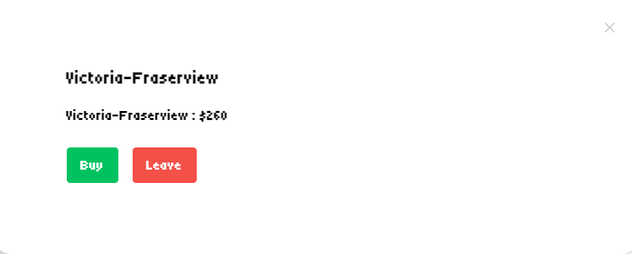
  - 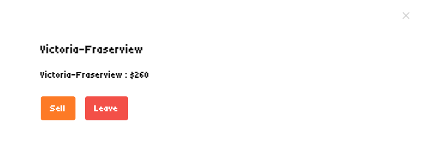

## 👥 Team Members

*Alphabetically ordered*

| Frontend | Backend | QA | UI/UX | PM |
|----------|----------|----------|----------|----------|
| Alex Deschenes | Abdulqaidr Abuharrus [](https://github.com/Abdo-Abuharrus211) | Derek Tran [](https://github.com/ddderekk) | Filip Budd [](https://github.com/filipbudd/) | Calvin Lee [](https://github.com/calvinnleeee/) |
| Caleb Chiang [](https://github.com/calebchiang) | Clement Quanch [](https://github.com/Clement-Quach) | Flora Deng [](https://github.com/FloraDeng00) | | Jesse McKenzie [](https://github.com/JDMCK) |
| Echo Wang [](https://github.com/EchooWww) | Irix Xu [](https://github.com/IrisWRX) | Inez Yoon [](https://github.com/Inez-y) | | |
| Princeton Dychinco [](https://github.com/pdychinco) | Jaiden Duncan | Niko Wang [](https://github.com/nzzzzzw) | | |
| Quincy Wong [](https://github.com/phoenixalpha204) | Joanne Ho | Richard Maceda [](https://github.com/Organic-156) | | |
| Saeyoung Park [](https://github.com/eesope/) | Matthew Yoon | | | |
|  | Nathan Yau [](https://github.com/nathan-yau) | | | |
|  | Erick Deau [](https://github.com/eric-deau) | | | |


## 💡 Learn more

### Phoenix Web Framework
  * Official website: https://www.phoenixframework.org/
  * Guides: https://hexdocs.pm/phoenix/overview.html
  * Docs: https://hexdocs.pm/phoenix
  * Forum: https://elixirforum.com/c/phoenix-forum
  * Source: https://github.com/phoenixframework/phoenix

### Elixir
  * Official website: https://elixir-lang.org/
  * Guides: https://hexdocs.pm/elixir/introduction.html
  * Docs: https://elixir-lang.org/docs.html
  * Blog: https://elixir-lang.org/blog/ 

### Monopoly (boardgame)
  * Wikipedia: https://en.wikipedia.org/wiki/Monopoly_(game)
