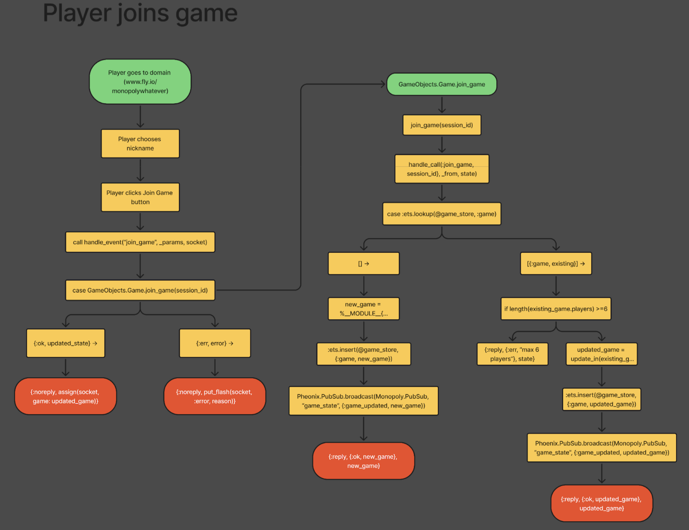
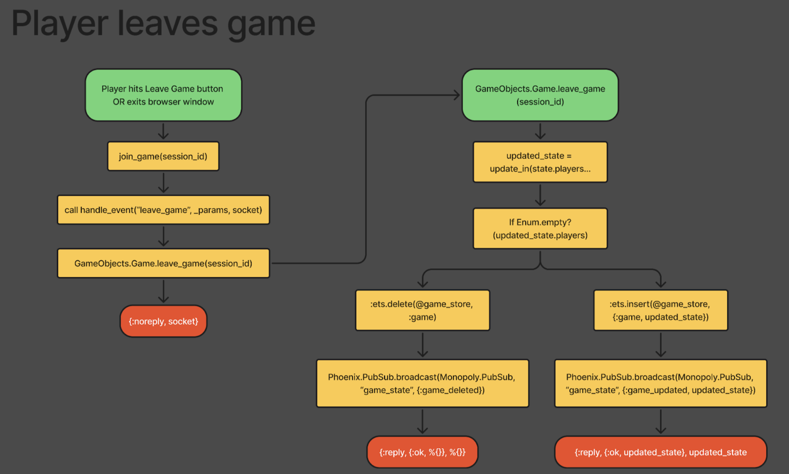
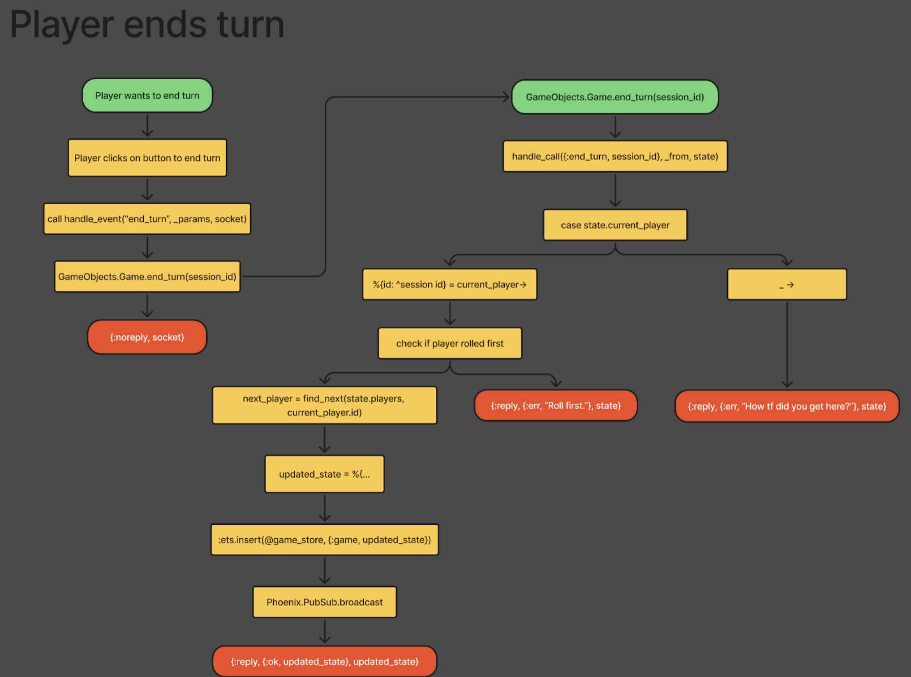
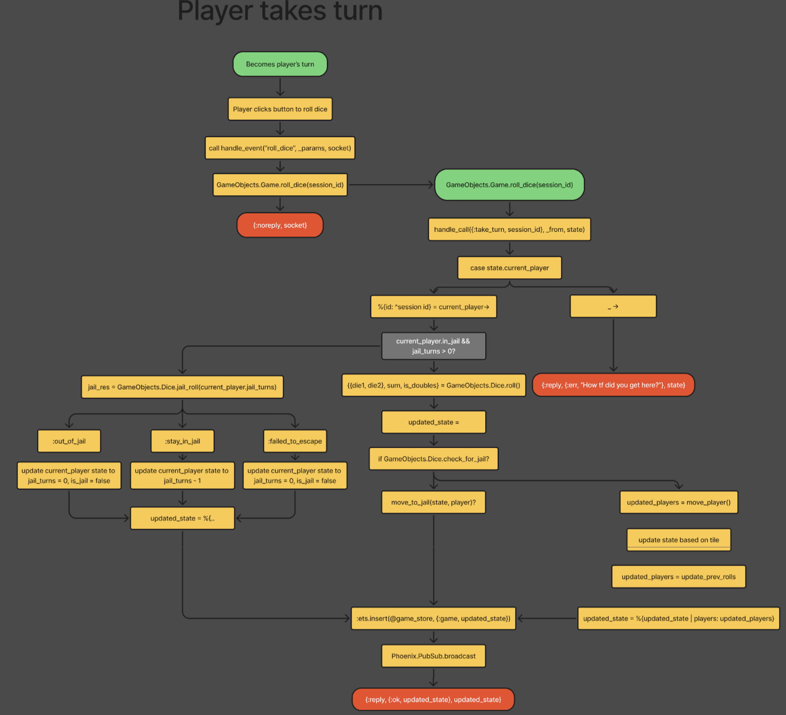
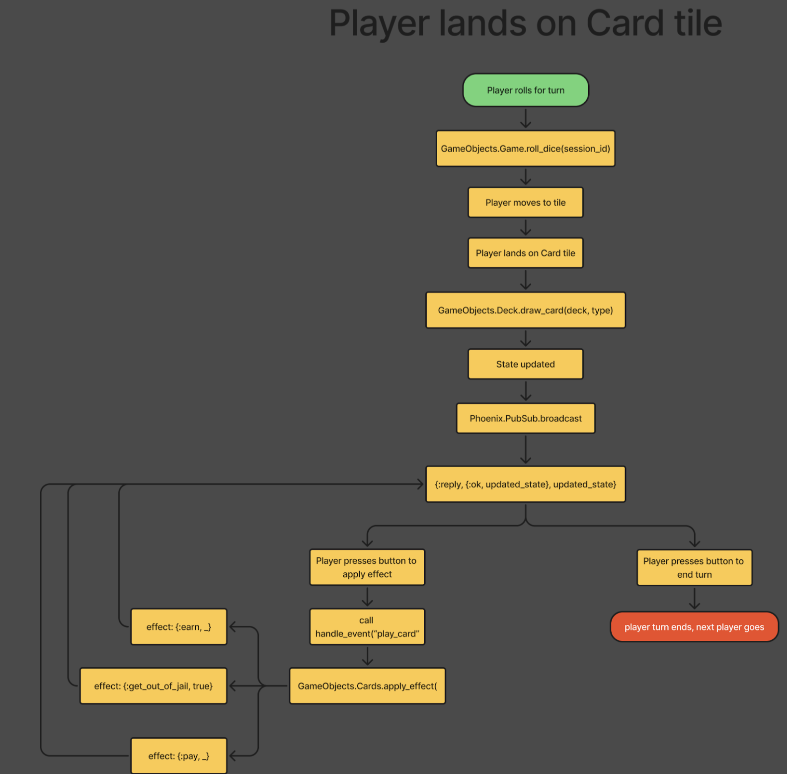
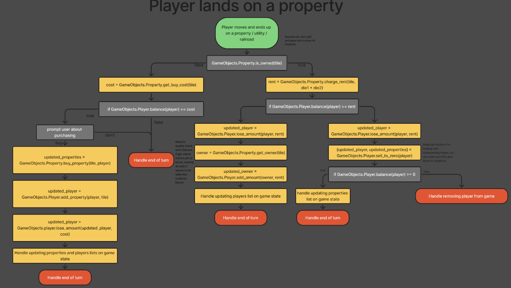

# Monopoly: Vancouver Housing Market 

## 🏫 BCIT COMP4959 Project

  ✨ Ever dreamed of owning property in Vancouver? ✨

  Play **Vancouver Housing Market** with your friends and live out your real estate fantasies.

  Without the crushing mortgage, you'll start with $1,500, which is enough to buy several properties and a bucket of bluberries *just like our grandparents*!

  Buy up propertie**s** without a down payment, charge rent, and send your misbehaving buddies to jail... where there’s actually enough room to hold them.

  **Vancouver Housing Market** is inpired by the classic board game Monopoly, with an Elixir/Phoenix implementation.

  Now it’s your turn to make your dream come true—own your favourite neighbourhood! 

## 💻 How To Run

To play with your friends, visit [Website]() from your favourite browser.

To run the game locally, [`localhost:4000`](http://localhost:4000).

## 🎮 How to Play

1. Call your friend(s) to play with!

2. On your favourite browser, access [`localhost:4000`](http://localhost:4000) 

3. Click the `Join the lobby` button
(add image)

4. If everyone's around, hit `Start game`
(add image)

5. On your turn, click the available buttons 
(add image)

6. Don't worry. The system will handle complex math for you!

7. Wait for your friends turn
(add image)

8. Repeat until only one player survives!
(add image)

## 🎲 Game Rule
- careate a game and enter a lobby
- 2-6 players, each with a specific starting token (car, hat, thimble, shoe, etc.).
- Loop through users, on each user’s turn
    - Roll 2 dice
    - Move by amount shown on dice (if you roll double, take turn and roll again. If you roll double for a third time in a row, go directly to jail).
      -  Passing GO grants the player a monetary bonus of ($200).
    - On board space
        - If property space:
          - https://en.wikibooks.org/wiki/Monopoly/Properties_reference 
        - Option to buy if it is not owned. If you don’t want to buy, it goes to an auction for all the players.
        - If it is owned, pay rent to the owner.
      - If WATER WORKS or ELECTRIC COMPANY:
          - https://monopoly.fandom.com/wiki/Utility 
          - You may purchase the utility if it is not owned.
          - If it is owned, you must pay 4 times your dice roll to the owner if they own only that utility. If they own both, you must pay 10 times your dice roll.
      - If RAILROADS ( WE MAKING THEM REGULAR ):
          - https://monopoly.fandom.com/wiki/Railroads 
          - You may purchase the railroad if it is not owned.
          - If it is owned, you must pay the amount owed in accordance with the amount of stations owned by the owner of the station you landed on.
      - If COMMUNITY CHEST, draw a community chest card.
        - https://monopoly.fandom.com/wiki/Community_Chest 
      - If CHANCE, draw a chance card.
        - https://monopoly.fandom.com/wiki/Chance#Cards 
      - If the tile is JAIL, only visit.
        - https://monopoly.fandom.com/wiki/Jail 
        - If you were sent to jail by card effect or landing on ‘Go To Jail’, you stay in jail for 3 turns.
        - If jailed by an effect, player can escape by: 
          - Paying the fine ($50)
          - Rolling doubles on any of the three turns in jail. Move forward using the result, but the player doesn’t get an extra throw.
          - Using a ‘Get out of jail free’ card (drawn from either card pile)
        - Player WILL leave the jail after the third throw and pay the fine if the third throw is not a double.
        - If not ‘sent to Jail’, players that reach this space incur no penalty and take a break.
      - If FREE PARKING space, rest for free.
      - If GO TO JAIL, go to jail
      - If LUXURY TAX, pay ($100)
      - If INCOME TAX, pay (10%) OR ($100), whichever is lower
    - Hand over the turn to the next player

## 👾 Play Flowchart

## 🔀 Game Logic Flowchart
- Player joins game

  

- Player leaves game

  

- Player ends turn

  

- Player takes turn

  

- Player lands on card tile

  

- Player lands on property

  

## 🔍 How to test / debug

  Install dependencies
  - Run `mix setup` to install and setup dependencies
  
  To run test files:
  - Run `mix test`
  - If you get 0 failtures, tests are successefully done
  - If you want to add more unit tests, add `.exs` files in `/test`
    - Currently availalbe tests:
  
  To debug on your local:
  - Start Phoenix endpoint with `mix phx.server` or inside IEx with `iex -S mix phx.server`

  - visit [`localhost:4000`](http://localhost:4000) from your browser.

## File Structure

## 👥 Team Members

*in alphabetical order*

| Frontend | Backend | QA | UI/UX | PM |
|----------|----------|----------|----------|----------|
| Alex Deschenes | Abdulqaidr Abuharrus  | Derek Tran  | Filip Budd  | Calvin Lee  |
| Caleb Chiang  | Clement Quanch  | Flora Deng  | | Jesse McKenzie  |
| Echo Wang  | Irix Xu  | Inez Yoon  | | |
| Princeton Dychinco  | Jaiden Duncan | Niko Wang  | | |
| Quincy Wong  | Joanne Ho | Richard Maceda  | | |
| Saeyoung Park  | Matthew Yoon | | | |
|  | Nathan Yau  | | | |
|  | Erick Deau  | | | |

## 💡 Learn more

Phoenix Web Framework
  * Official website: https://www.phoenixframework.org/
  * Guides: https://hexdocs.pm/phoenix/overview.html
  * Docs: https://hexdocs.pm/phoenix
  * Forum: https://elixirforum.com/c/phoenix-forum
  * Source: https://github.com/phoenixframework/phoenix

Elixir
  * Official website: https://elixir-lang.org/
  * Guides: https://hexdocs.pm/elixir/introduction.html
  * Docs: https://elixir-lang.org/docs.html
  * Blog: https://elixir-lang.org/blog/ 

Monopoly (boardgame)
  * Wikipedia: https://en.wikipedia.org/wiki/Monopoly_(game)
